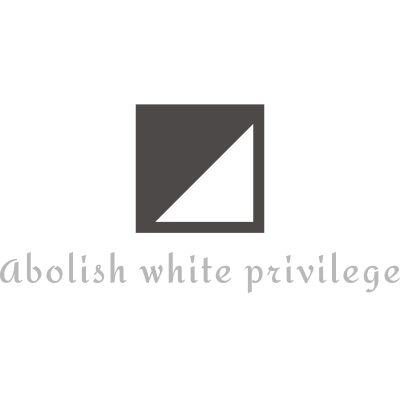

<h1 align="center">
 

 
</h1>

### Shall We?

- Knowing something isn't bad. Enforcement is bad. Alright, let's start with a few words and their meaning.

	- __Abolish__
		- formally put an end to (a system, practice, or institution).

	- __White__
		- of the colour of milk or fresh snow, due to the reflection of all visible rays of light; the opposite of black.

	- __Privilege__
		- a special right, advantage, or immunity granted or available only to a particular person or group.

- __White Privilege...?__

	- White privilege is the societal privilege that benefits people whom society identifies as white in some countries, beyond what is commonly experienced by non-white people under the same social, political, or economic circumstances.

### Common Points

- __I've faced racism__.
	- Hell yeah. Who hasn't?

- __I crack jokes on different races__.

	- Hell yeah. Who doesn't?

		- Cracking jokes makes you a racist.

			- Jokes are not opinion. Your opinion makes you a racist, not jokes.

			- Laughing on a joke doesn't make you a racist.

		- I like curry.

	- I'm so offended right now.

### Common Questions

- __Why did I made this?__

	- For fun!

	- Thanks to the __YouTube__ and __White People__ talking about the __White Privilege__.

		- __Sounds like some hypocrite shit, isn't it?__

			- Hell yeah, it is.

	- Thanks to the __Snowflakes__

	- Thanks to the __Trump Haters__

		- Snowflakes

- __What do I have to do with White Privilege?__

	- Absolutely nothing.

		- __So, why?__

			- I just told you.

### License

MIT &copy; 2018 [Rishi Giri](https://rishi.ml)
